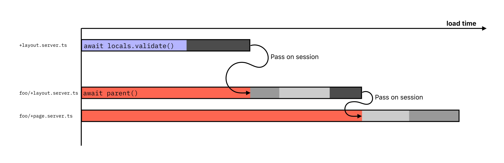
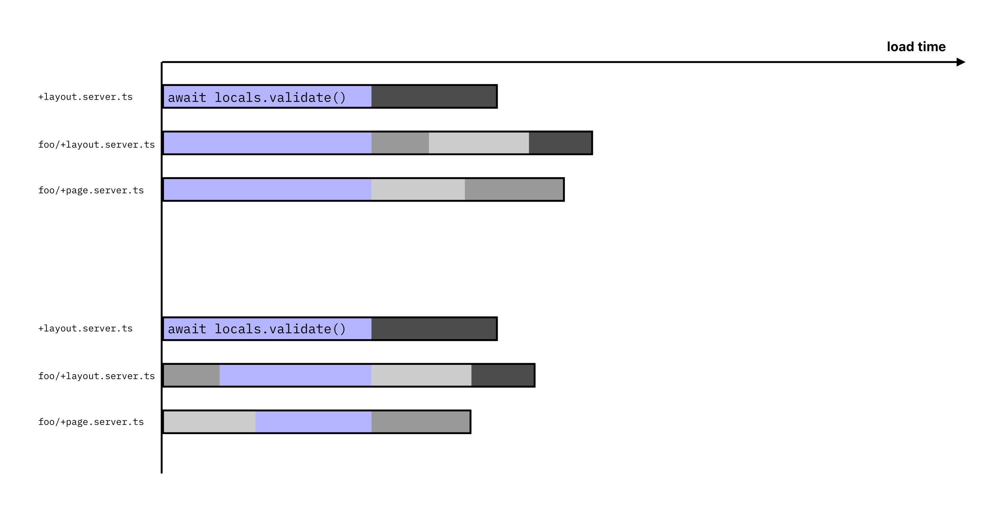

In general, data fetching and auth guards should be handled solely with server load functions, and not shared load functions.

```ts
// +page.server.ts
import type { PageServerLoad } from "./$types";

export const load: PageServerLoad = async ({ locals }) => {
	const { session } = await locals.auth.validateUser();
	if (!session) {
		// unauthenticated
	}
};
```

A common pattern in SvelteKit is to get the current auth state in the root layout and pass the data to the child routes:



However, doing so would mean all child load functions would have to wait for the parent to resolve, causing a waterfall just by trying to get the current auth state. Ideally, you'd want to validate the request inside each load functions so they can run independently of each other, but not make multiple requests to the database.

As such, [`authRequest.validateUser()`](/reference/lucia-auth/authrequest#validateuser) memoize the result. This means you can call these methods across multiple load functions in a single request (page load) and it will only call the database once.



Data required regardless of the auth state can also be fetched before calling one of the `locals` method to further improve load times.
